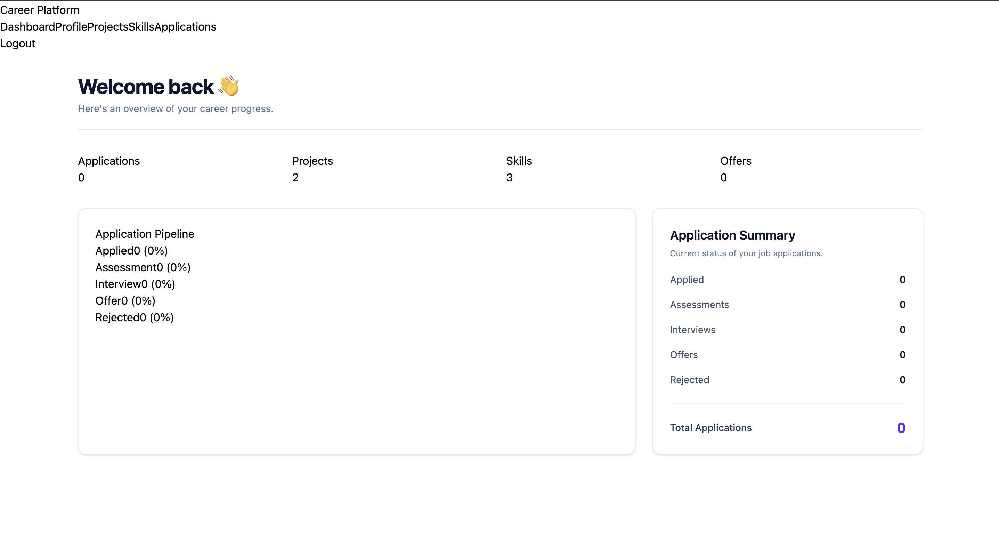
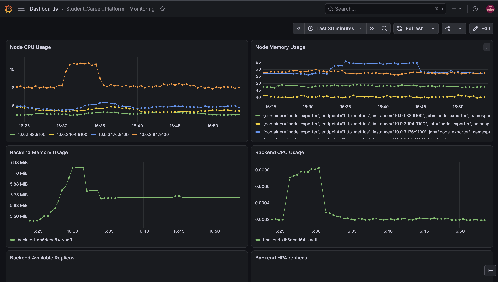
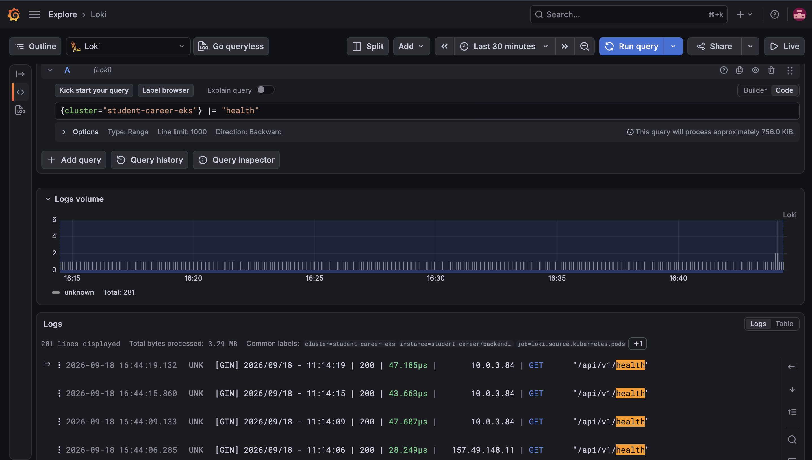
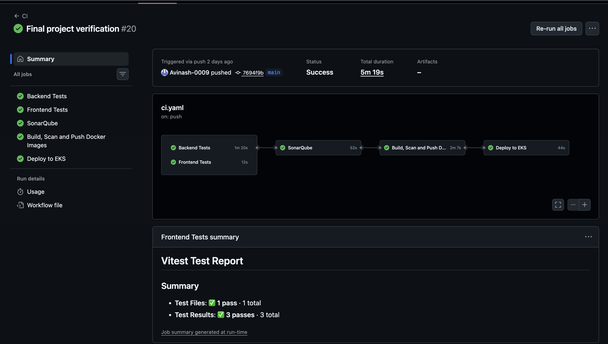

# Student Career Platform

A student career tracking platform where students manually log and manage their skill progress, projects, job applications, and profile — all in one dashboard. Built as a hands-on project to learn production-style DevOps practices: CI/CD, container security scanning, Kubernetes orchestration, infrastructure as code, and observability.

> **Live status:** Previously deployed on AWS EKS; infrastructure was destroyed after final verification to avoid ongoing AWS costs.

---

## What it does

- **Profile management** — students maintain their own profile
- **Skill tracking** — log and update skill levels manually
- **Project log** — record projects completed or in progress
- **Application tracker** — track job applications through states (Applied → Assessment → Interview → Offer / Rejected)
- **Dashboard** — a single view tying skills, projects, and applications together

This isn't an automated job-matching tool — it's a personal system of record students update themselves, similar to a structured career journal.

---

## Architecture

```
Developer push (main)
        │
        ▼
GitHub Actions
        │
        ├─► SonarQube        (static code analysis)
        ├─► Trivy            (container image vulnerability scan)
        ├─► Build image
        ├─► Push to ECR      (via GitHub OIDC — no static AWS keys)
        │
        ▼
Deploy to Amazon EKS
        │
        ├─ Go/Gin backend  ─┐   (app deploy via GitHub Actions + `kubectl set image`)
        ├─ React frontend  ─┤─ behind AWS Load Balancer Controller (ALB Ingress)
        ├─ PostgreSQL       │
        │                   │
        ├─ Metrics Server ──┴─► HPA (pod autoscaling)
        ├─ Cluster Autoscaler   (node autoscaling, IAM role via EKS Pod Identity)
        │
        └─ Observability stack
              Alloy ─► Loki ─► Grafana (logs)
              Prometheus ─────► Grafana (metrics)

(Helm is used for infrastructure components — monitoring stack, Loki, Alloy,
Cluster Autoscaler, AWS Load Balancer Controller — not for deploying the app itself.)
```

**Infrastructure provisioning:** Terraform (state kept local by design — see [Design Decisions](#design-decisions))


---

## Tech Stack

| Layer | Technology |
|---|---|
| Backend | Go, Gin |
| Frontend | React |
| Database | PostgreSQL |
| Containers | Docker |
| Orchestration | Kubernetes (Amazon EKS) |
| Package management | Helm |
| IaC | Terraform |
| CI/CD | GitHub Actions |
| Code quality | SonarQube |
| Security scanning | Trivy |
| Container registry | Amazon ECR |
| Ingress | AWS Load Balancer Controller |
| Autoscaling | Metrics Server + HPA (pods), Cluster Autoscaler (nodes) |
| Observability | Prometheus, Grafana, Loki, Alloy |
| Secrets | Kubernetes Secrets (EKS default envelope encryption via KMS v2) |
| Auth to AWS | GitHub OIDC (CI/CD) + EKS Pod Identity (in-cluster workloads, e.g. Cluster Autoscaler, AWS Load Balancer Controller, EBS CSI Controller); local Terraform uses an AWS CLI profile |

---

## Design Decisions

A few choices here were deliberate trade-offs, not oversights — noting them so the reasoning isn't lost:

- **Terraform runs manually (plan/apply), not in the pipeline.** The app deploy pipeline is fully automated, but Terraform changes are reviewed by hand before every apply. Infrastructure mistakes are harder to undo than a bad app deploy, so this was a deliberate choice to keep a human in the loop for the plan/apply step.
- **Kubernetes Secrets over the Secrets Store CSI Driver / ASCP add-on.** ASCP was evaluated and tested, but it adds a DaemonSet on every node, which was unnecessary overhead for this project's scale. Went with native K8s Secrets instead, which are still encrypted at rest via EKS's default envelope encryption (KMS v2, enabled automatically on EKS 1.28+).
- **Terraform state is local (gitignored), not remote.** Acceptable for a solo project; the natural next step for team use would be an S3 backend with DynamoDB state locking.
- **Direct push to `main`, no PR gate.** This is a solo project. In a team setting, feature branches with PR review before merge would replace this.
- **Pod Identity associations were configured manually via AWS CLI.** These cover Cluster Autoscaler, AWS Load Balancer Controller, and the EBS CSI Controller. For this learning project, we kept them outside Terraform to avoid unnecessary infrastructure changes. In a production environment, these associations would be managed through Terraform (via the `aws_eks_pod_identity_association` resource) for full reproducibility.

---

## Screenshots

| | |
|---|---|
| Application UI |  |
| Grafana Dashboard |  |
| Loki Logs |  |
| CI/CD Pipeline (green run) |  |

---

## Repository Structure

```
.
├── backend/            # Go/Gin API
├── frontend/           # React app
├── k8s/                # Kubernetes manifests / Helm values
│   └── monitoring/     # Prometheus, Grafana, Loki, Alloy configs
├── terraform/          # Infrastructure as code
├── docs/               # Screenshots and supporting docs
├── .github/workflows/  # CI/CD pipeline definitions
└── docker-compose.yml
```

---

## Running Locally

```bash
git clone https://github.com/Avinash-0009/student-career-platform.git
cd student-career-platform
docker compose up --build
```

`docker-compose up` starts three services:

- PostgreSQL
- Go backend
- React frontend

Once running:

- Frontend: [http://localhost:5173](http://localhost:5173)
- Backend health check: [http://localhost:8080/api/v1/health](http://localhost:8080/api/v1/health)

---

## What I'd Improve Next

Being upfront about the natural next steps, rather than presenting this as finished:

- Migrate Terraform state to a remote backend (S3 + DynamoDB locking)
- Manage EKS Pod Identity associations through Terraform instead of AWS CLI, for full reproducibility (a production-environment improvement over this project's manual setup)
- Add PR-based review workflow for team collaboration
- Evaluate a customer-managed KMS key for Secrets encryption instead of the AWS-owned default
- Add distributed tracing (OTel) alongside existing logs/metrics

---

## Author

**Avinash** — Aspiring Cloud Architect, GD Goenka University
